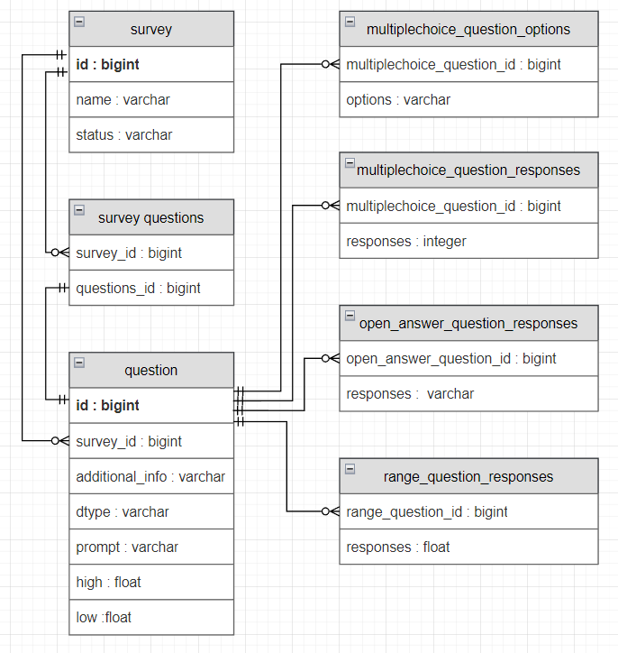
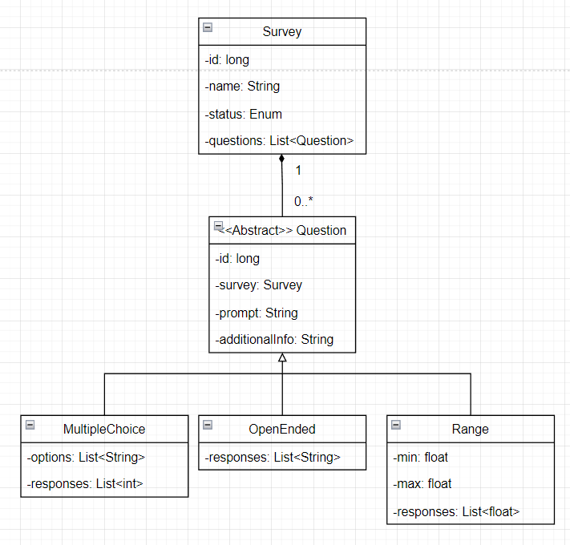

# BasedSurvey
```
⠘⡀⠀⠀⠀⠀⠀⠀⠀⠀⠀⠀⠀⠀⠀⠀⠀⠀⠀⠀⠀⠀⠀⠀⡜⠀⠀⠀
⠀⠀⠀⠑⡀⠀⠀⠀⠀⠀⠀⠀⠀⠀⠀⠀⠀⠀⠀⠀⠀⠀⠀⠀⠀⡔⠁⠀⠀⠀
⠀⠀⠀⠀⠈⠢⢄⠀⠀⠀⠀⠀⠀⠀⠀⠀⠀⠀⠀⠀⠀⠀⣀⠴⠊⠀⠀⠀⠀⠀
⠀⠀⠀⠀⠀⠀⠀⢸⠀⠀⠀⢀⣀⣀⣀⣀⣀⡀⠤⠄⠒⠈⠀⠀⠀⠀⠀⠀⠀⠀
⠀⠀⠀⠀⠀⠀⠀⠘⣀⠄⠊⠁⠀⠀⠀⠀⠀⠀⠀⠀⠀⠀⠀⠀⠀⠀⠀⠀⠀⠀
⠀
⣿⣿⣿⣿⣿⣿⣿⣿⡿⠿⠛⠛⠛⠋⠉⠈⠉⠉⠉⠉⠛⠻⢿⣿⣿⣿⣿⣿⣿⣿
⣿⣿⣿⣿⣿⡿⠋⠁⠀⠀⠀⠀⠀⠀⠀⠀⠀⠀⠀⠀⠀⠀⠀⠉⠛⢿⣿⣿⣿⣿
⣿⣿⣿⣿⡏⣀⠀⠀⠀⠀⠀⠀⠀⣀⣤⣤⣤⣄⡀⠀⠀⠀⠀⠀⠀⠀⠙⢿⣿⣿
⣿⣿⣿⢏⣴⣿⣷⠀⠀⠀⠀⠀⢾⣿⣿⣿⣿⣿⣿⡆⠀⠀⠀⠀⠀⠀⠀⠈⣿⣿
⣿⣿⣟⣾⣿⡟⠁⠀⠀⠀⠀⠀⢀⣾⣿⣿⣿⣿⣿⣷⢢⠀⠀⠀⠀⠀⠀⠀⢸⣿
⣿⣿⣿⣿⣟⠀⡴⠄⠀⠀⠀⠀⠀⠀⠙⠻⣿⣿⣿⣿⣷⣄⠀⠀⠀⠀⠀⠀⠀⣿
⣿⣿⣿⠟⠻⠀⠀⠀⠀⠀⠀⠀⠀⠀⠀⠶⢴⣿⣿⣿⣿⣿⣧⠀⠀⠀⠀⠀⠀⣿
⣿⣁⡀⠀⠀⢰⢠⣦⠀⠀⠀⠀⠀⠀⠀⠀⢀⣼⣿⣿⣿⣿⣿⡄⠀⣴⣶⣿⡄⣿
⣿⡋⠀⠀⠀⠎⢸⣿⡆⠀⠀⠀⠀⠀⠀⣴⣿⣿⣿⣿⣿⣿⣿⠗⢘⣿⣟⠛⠿⣼
⣿⣿⠋⢀⡌⢰⣿⡿⢿⡀⠀⠀⠀⠀⠀⠙⠿⣿⣿⣿⣿⣿⡇⠀⢸⣿⣿⣧⢀⣼
⣿⣿⣷⢻⠄⠘⠛⠋⠛⠃⠀⠀⠀⠀⠀⢿⣧⠈⠉⠙⠛⠋⠀⠀⠀⣿⣿⣿⣿⣿
⣿⣿⣧⠀⠈⢸⠀⠀⠀⠀⠀⠀⠀⠀⠀⠀⠟⠀⠀⠀⠀⢀⢃⠀⠀⢸⣿⣿⣿⣿
⣿⣿⡿⠀⠴⢗⣠⣤⣴⡶⠶⠖⠀⠀⠀⠀⠀⠀⠀⠀⠀⠀⠀⣀⡸⠀⣿⣿⣿⣿
⣿⣿⣿⡀⢠⣾⣿⠏⠀⠠⠀⠀⠀⠀⠀⠀⠀⠀⠀⠀⠀⠀⠀⠛⠉⠀⣿⣿⣿⣿
⣿⣿⣿⣧⠈⢹⡇⠀⠀⠀⠀⠀⠀⠀⠀⠀⠀⠀⠀⠀⠀⠀⠀⠀⠀⣰⣿⣿⣿⣿
⣿⣿⣿⣿⡄⠈⠃⠀⠀⠀⠀⠀⠀⠀⠀⠀⠀⠀⠀⠀⠀⢀⣠⣴⣾⣿⣿⣿⣿⣿
⣿⣿⣿⣿⣧⡀⠀⠀⠀⠀⠀⠀⠀⠀⠀⠀⠀⠀⢀⣠⣾⣿⣿⣿⣿⣿⣿⣿⣿⣿
⣿⣿⣿⣿⣷⠀⠀⠀⠀⠀⠀⠀⠀⠀⠀⠀⢀⣴⣿⣿⣿⣿⣿⣿⣿⣿⣿⣿⣿⣿
⣿⣿⣿⣿⣿⣦⣄⣀⣀⣀⣀⠀⠀⠀⠀⠘⣿⣿⣿⣿⣿⣿⣿⣿⣿⣿⣿⣿⣿⣿
⣿⣿⣿⣿⣿⣿⣿⣿⣿⣿⣿⣷⡄⠀⠀⠀⣿⣿⣿⣿⣿⣿⣿⣿⣿⣿⣿⣿⣿⣿
⣿⣿⣿⣿⣿⣿⣿⣿⣿⣿⣿⣿⣧⠀⠀⠀⠙⣿⣿⡟⢻⣿⣿⣿⣿⣿⣿⣿⣿⣿
⣿⣿⣿⣿⣿⣿⣿⣿⣿⣿⣿⣿⠇⠀⠁⠀⠀⠹⣿⠃⠀⣿⣿⣿⣿⣿⣿⣿⣿⣿
⣿⣿⣿⣿⣿⣿⣿⣿⡿⠛⣿⣿⠀⠀⠀⠀⠀⠀⠀⠀⢐⣿⣿⣿⣿⣿⣿⣿⣿⣿
⣿⣿⣿⣿⠿⠛⠉⠉⠁⠀⢻⣿⡇⠀⠀⠀⠀⠀⠀⢀⠈⣿⣿⡿⠉⠛⠛⠛⠉⠉
⣿⡿⠋⠁⠀⠀⢀⣀⣠⡴⣸⣿⣇⡄⠀⠀⠀⠀⢀⡿⠄⠙⠛⠀⣀⣠⣤⣤⠄⠀
```
## Description
- What?
- Where?
- Why?
- When?
- How?

There's so many important questions that need to be asked, but since the dawn of civilization people have been forced to ask them in cringe ways.
Here at based-4806 we decided to think different. We decided to think **BASED**.
BasedSurvey is a platform to make, edit, analyze and answer surveys in a non-cringe way. 
It's not just our users who get to enjoy being based. Basedness is embedded into our very own stack.
- **BASED**-TML (HTML)
- **BASED**-TMX (HTMX)
- **BASED**cading Style Sheets (CSS)
- Spring **BASED** (Spring boot)
- Hy**BASED**nate (Hybernate)
- **BASED**ven (Maven)
- **BASED**Unit (JUnit)
- Project Lom**BASED** (Project Lombok)
- **BASED**hub issues (GitHub issues)
## Installation
download the repository and run mvn package
Note: we highly recommend making this an alias by doing
`alias based='mvn package'`
on unix systems

## Usage
Go to the based homepage and start using it

## Database Schema

## UML for Model



## Early Prototype Progress
Met all functional requirements for the assignment. The website has pages for viewing surveys, filling them out, viewing results and making surveys.
There are unit tests for each of these functions.

## Plan for March 15
- Start incorporating HTMX and REST controllers
- Making the project more BASED.
- add stylesheets to make the website easier on the eyes
